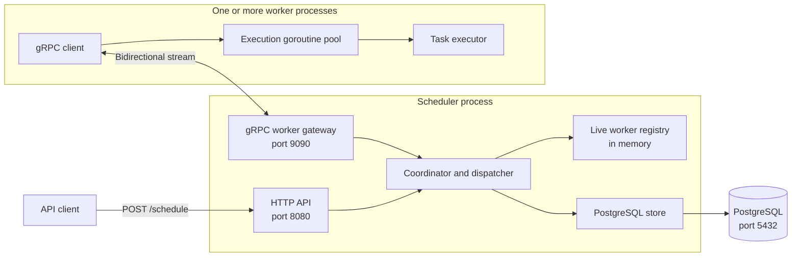
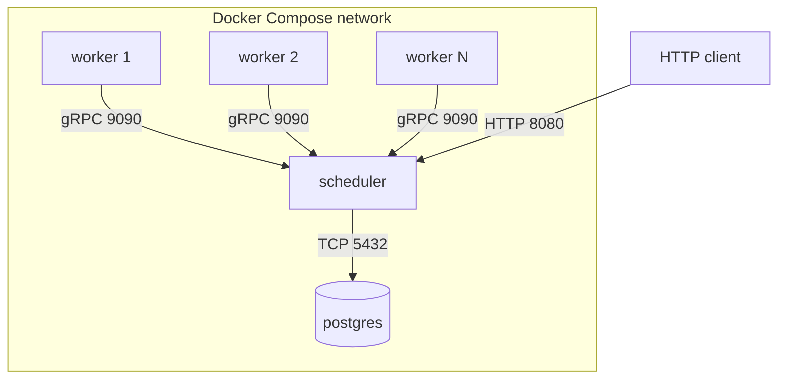
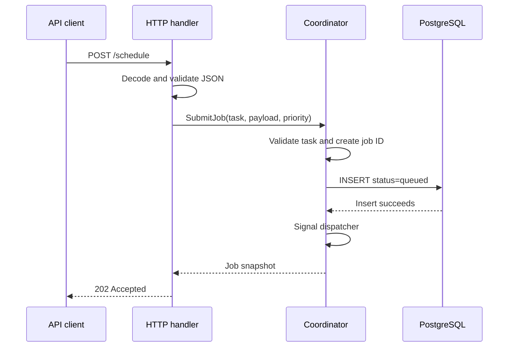
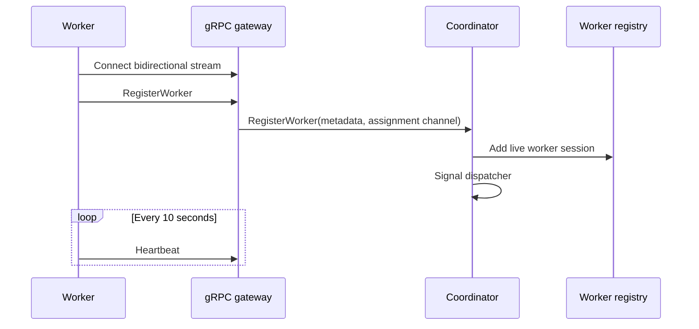
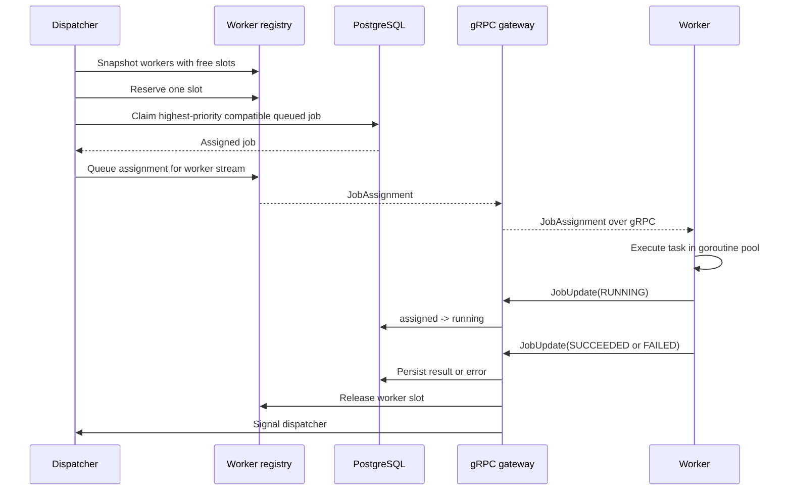
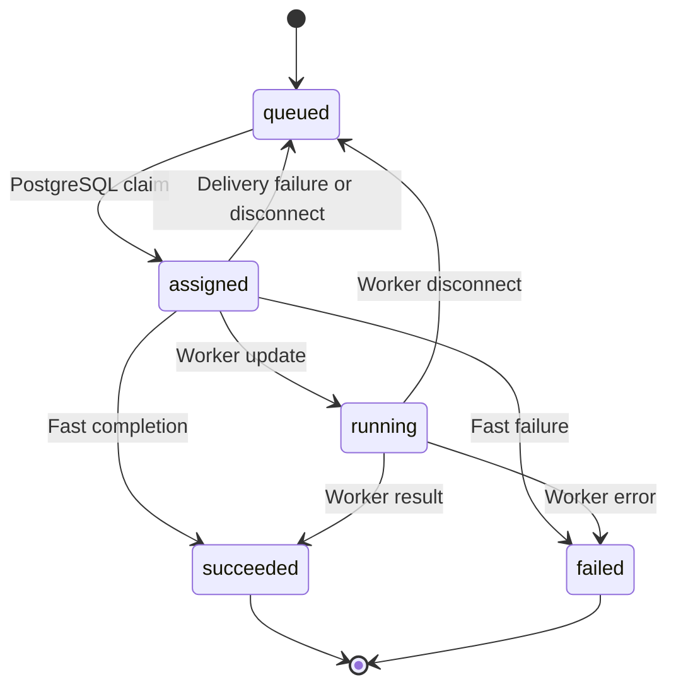

# Distributed Scheduler: High-Level and Low-Level Design

**Status:** Current implementation
**Last updated:** 2026-09-20
**Scope:** Immediate jobs, one scheduler instance, PostgreSQL, and horizontally scalable workers

**Related documents:** [Design Decisions and Rationale](design-decisions.md) · [Local Run and Test Runbook](runbook.md)

## 1. Purpose

The system accepts immediate jobs over HTTP, stores them durably in PostgreSQL, assigns them to compatible workers with free capacity, executes them, and records the final result.

The currently supported tasks are:

- `generate-report`
- `send-email`
- `send-notification`

Each task is a dummy implementation that waits for a random duration from 2 through 10 seconds and returns `Job done successfully`.

Cron schedules, delayed jobs, retries, authentication, and high availability for the scheduler are outside the current implementation.

## 2. High-level architecture



### 2.1 Runtime services

| Service | Responsibility | Durable state | Default port |
|---|---|---:|---:|
| Scheduler HTTP API | Accept and validate jobs | No | `8080` |
| Scheduler coordinator | Dispatch jobs and track worker capacity | Worker state is in memory | N/A |
| Scheduler gRPC gateway | Register workers, send assignments, receive updates | No | `9090` |
| PostgreSQL | Store jobs, results, and migration history | Yes | `5432` |
| Worker | Connect to the scheduler and execute assignments | No | No inbound port |

The HTTP API and gRPC gateway run inside the same scheduler process. Workers are separate processes and can be started or scaled independently.

## 3. Deployment topology



The worker opens an outbound connection to the scheduler. A worker does not need its own listening port or service-discovery address.

Docker Compose can increase the number of worker processes without changing scheduler configuration:

```bash
docker compose up -d --build --scale worker=5
```

`WORKER_CAPACITY` controls how many jobs each worker can execute concurrently. Worker count and worker capacity are separate scaling controls.

## 4. End-to-end behavior

### 4.1 Job submission



Example request:

```json
{
  "task": "send-email",
  "priority": 25,
  "payload": {
    "to": "learner@example.com",
    "subject": "Scheduler test"
  }
}
```

Example response:

```json
{
  "job_id": "GWYLU4PBNRCZM6UFIRURI2DDZH",
  "task": "send-email",
  "payload": {
    "to": "learner@example.com",
    "subject": "Scheduler test"
  },
  "priority": 25,
  "status": "queued",
  "created_at": "2026-09-20T07:41:22.968659872Z"
}
```

The response describes the job at creation time. The dispatcher can assign it immediately after persistence, so its database state may already have progressed by the time the client receives the response.

### 4.2 Worker registration



The first event on every new stream must be `RegisterWorker`. Registration includes:

- A non-empty worker ID.
- A positive capacity.
- At least one supported task.

Duplicate active worker IDs are rejected.

### 4.3 Dispatch and execution



The dispatcher continues assigning jobs until either:

- No compatible queued job remains.
- No connected worker has a free slot.

### 4.4 Worker disconnection

When a worker stream closes:

1. The worker session is removed from the in-memory registry.
2. Its `assigned` and `running` jobs are changed back to `queued`.
3. The dispatcher is signalled so another connected worker can claim them.

This supports ordinary process termination and detected connection loss. Job leases are still required to recover reliably from every abrupt scheduler failure.

## 5. External interfaces

### 5.1 HTTP API

#### `POST /schedule`

| Field | Type | Required | Meaning |
|---|---|---:|---|
| `task` | string | Yes | One of the three supported task names |
| `payload` | JSON object | No | Task-specific input; defaults to `{}` |
| `priority` | 32-bit integer | No | Larger values run before smaller values; defaults to `0` |

The endpoint returns:

- `202 Accepted` when the job is durably created.
- `400 Bad Request` for malformed JSON, missing tasks, or unsupported tasks.
- `500 Internal Server Error` if the job cannot be persisted.

The request body is limited to 1 MiB. Unknown JSON fields and multiple JSON values are rejected.

### 5.2 gRPC API

The protobuf contract is defined in `api/proto/scheduler/v1/worker.proto`.

```protobuf
service WorkerGateway {
  rpc Connect(stream WorkerEvent) returns (stream CoordinatorCommand);
}
```

Worker-to-scheduler events:

- `RegisterWorker`
- `Heartbeat`
- `JobUpdate`

Scheduler-to-worker commands:

- `JobAssignment`

The stream remains open for the worker's lifetime. Protocol Buffers generated Go types are stored under `gen/scheduler/v1`.

## 6. Data model

### 6.1 Jobs table

| Column | Type | Purpose |
|---|---|---|
| `id` | `TEXT` | Globally unique application-generated job ID |
| `task` | `TEXT` | Task implementation to invoke |
| `payload` | `JSONB` | Task-specific input object |
| `priority` | `INTEGER` | Dispatch ordering; larger values first |
| `status` | `TEXT` | Job lifecycle state |
| `assigned_worker_id` | `TEXT`, nullable | Worker responsible for the current attempt |
| `result` | `TEXT`, nullable | Successful output |
| `error_message` | `TEXT`, nullable | Failure description |
| `created_at` | `TIMESTAMPTZ` | Creation time in UTC |
| `updated_at` | `TIMESTAMPTZ` | Last persisted transition time |

The partial queued-job index is ordered by priority descending and creation time ascending. A second partial index supports finding unfinished jobs assigned to a worker.

### 6.2 Job state machine



The database uses a `CHECK` constraint to reject unknown status values. Update statements also verify the current state and assigned worker before accepting a transition.

## 7. Low-level design

### 7.1 Package layout

| Path | Responsibility |
|---|---|
| `cmd/scheduler` | Scheduler process startup and shutdown |
| `cmd/worker` | Worker process startup, gRPC client, and execution goroutines |
| `internal/scheduler/httpapi` | HTTP transport and JSON validation |
| `internal/scheduler/grpcapi` | gRPC transport and protobuf/domain conversion |
| `internal/scheduler/coordinator` | Job submission, worker registry, capacity, and dispatch |
| `internal/scheduler/domain` | Job, assignment, update, and status types |
| `internal/scheduler/store/postgres` | Persistence, atomic claims, transitions, and migrations |
| `internal/task` | Shared supported task names and parsing |
| `internal/worker` | Task executor and dummy task implementations |
| `api/proto/scheduler/v1` | Source gRPC contract |
| `gen/scheduler/v1` | Generated protobuf and gRPC Go code |

### 7.2 Scheduler startup

The scheduler performs these steps in order:

1. Read HTTP, gRPC, and database configuration.
2. Create a 10-second startup context.
3. Open and ping the PostgreSQL pool.
4. Run embedded migrations under a PostgreSQL advisory transaction lock.
5. Construct the coordinator.
6. Construct the HTTP server on `:8080`.
7. Construct and register the gRPC server on `:9090`.
8. Start the coordinator dispatch loop.
9. Start both network servers in separate goroutines.
10. Wait for a server error or an operating-system shutdown signal.

HTTP shutdown has a five-second deadline. The gRPC server is stopped so long-lived worker streams are terminated and their cleanup runs.

### 7.3 Coordinator dispatch signalling

The coordinator contains a buffered channel with capacity one:

```text
dispatchRequest chan struct{} // capacity 1
```

Job creation, worker registration, job completion, and worker removal request dispatch. Sending is non-blocking. Ten simultaneous requests can therefore collapse into one pending signal because one dispatch pass drains all currently possible work.

Only the coordinator's `Run` goroutine calls the dispatch loop. This serializes in-process dispatch decisions while HTTP and gRPC handlers remain concurrent.

### 7.4 Worker registry

The registry is a map keyed by worker ID. Each live session contains:

- Worker ID.
- Capacity.
- Current active-job count.
- Supported tasks.
- A buffered assignment channel.
- A set of job IDs assigned to that worker.

A `sync.RWMutex` protects the map and mutable session fields. Read-only snapshots use `RLock`; registration, removal, slot reservation, and completion use `Lock`.

The dispatcher takes a snapshot of available workers, releases the mutex, and then calls PostgreSQL. Database I/O never occurs while holding the registry mutex.

### 7.5 Capacity reservation

Before claiming a database job, the coordinator atomically increments the selected worker's active-job count under the mutex. This prevents two concurrent paths from using the same final slot.

If no compatible job exists or the database claim fails, the reservation is released. After a successful claim, the assignment is put on that worker's channel. A terminal update removes the job ID and releases the slot.

The assignment channel is buffered to the worker's declared capacity. This represents assignments accepted for delivery to that worker and provides bounded backpressure.

### 7.6 Atomic database claim

The store claims jobs with one PostgreSQL statement:

```sql
WITH candidate AS (
    SELECT id
    FROM jobs
    WHERE status = 'queued' AND task = ANY($1)
    ORDER BY priority DESC, created_at ASC
    FOR UPDATE SKIP LOCKED
    LIMIT 1
)
UPDATE jobs
SET status = 'assigned', assigned_worker_id = $2, updated_at = NOW()
WHERE id = (SELECT id FROM candidate)
RETURNING ...;
```

The candidate selection and state change occur in the same database statement and transaction. The selected row is locked while it is claimed. `SKIP LOCKED` lets another concurrent claimant skip a row already being claimed instead of waiting for it.

### 7.7 gRPC stream handling

The scheduler's `Connect` handler:

1. Receives and validates the registration event.
2. Creates an assignment channel sized to worker capacity.
3. Registers the worker with the coordinator.
4. Starts one receive goroutine for worker events.
5. Uses the handler goroutine to select between assignments, incoming events, and cancellation.
6. Sends assignments through the stream from one goroutine.
7. Unregisters the worker when the handler exits.

Keeping one sender per stream avoids concurrent calls to gRPC `Send`.

### 7.8 Worker concurrency model

The worker creates exactly `WORKER_CAPACITY` execution goroutines. Each goroutine reads from a shared assignment channel and invokes the executor.

```text
gRPC receiver -> assignment channel -> N execution goroutines
                                      -> outbound event channel
single main loop -> gRPC Send
```

The main worker loop is the only code that sends on the gRPC stream. It serializes heartbeats and job updates. A `sync.WaitGroup` waits for execution goroutines during shutdown, while context cancellation stops running dummy tasks and unblocks channel operations.

### 7.9 Executor

The executor switches on the validated task name and calls one of three task methods. The current methods accept the payload but do not inspect it. Each waits on a timer or returns early when its context is cancelled.

Unsupported task names return an explicit error instead of silently succeeding.

### 7.10 Database connection management

The store uses `pgxpool.Pool`. HTTP handlers, the dispatcher, and gRPC update handlers may access PostgreSQL concurrently. The pool manages reusable connections and is safe for concurrent use.

All database operations receive a context so request cancellation or process shutdown can stop waiting work.

## 8. Configuration

### Scheduler

| Environment variable | Default | Meaning |
|---|---|---|
| `SCHEDULER_ADDRESS` | `:8080` | HTTP listen address |
| `SCHEDULER_GRPC_ADDRESS` | `:9090` | gRPC listen address |
| `DATABASE_URL` | Local scheduler database URL | PostgreSQL connection string |

### Worker

| Environment variable | Default | Meaning |
|---|---|---|
| `WORKER_ID` | Operating-system hostname | Unique worker identity |
| `WORKER_CAPACITY` | `1` | Maximum concurrent executions |
| `WORKER_SCHEDULER_ADDRESS` | `localhost:9090` | Scheduler gRPC address |

## 9. Correctness and failure behavior

### Implemented

- Jobs are persisted before dispatch is requested.
- Compatible jobs are claimed atomically.
- Worker capacity is reserved and released under a mutex.
- Only the assigned worker can advance a job.
- Invalid state transitions affect zero rows and are rejected.
- A detected worker disconnection requeues unfinished jobs.
- Context cancellation stops task timers and shutdown work.
- Migration execution is serialized across scheduler processes.

### Current limitations

- Heartbeats are accepted but the scheduler does not yet store `last_seen` or evict workers on a heartbeat timeout.
- There is no job lease or attempt number. An abrupt scheduler crash can leave `assigned` or `running` jobs stranded.
- The system does not provide exactly-once execution. A disconnect near completion can eventually cause the same job to execute again.
- The worker process does not implement internal reconnection with exponential backoff. Docker's restart policy restarts it after failure.
- There is no retry policy, maximum-attempt count, or dead-letter state.
- There is no HTTP endpoint to retrieve job status or result.
- HTTP and gRPC are unauthenticated, and gRPC uses plaintext credentials in the development setup.
- The live-worker registry belongs to one scheduler process. Multiple active scheduler replicas require ownership/routing or a shared coordination design.
- Metrics, distributed tracing, structured logs, and health endpoints are not implemented.

## 10. Recommended next milestones

1. Add `GET /jobs/{id}` for status and result retrieval.
2. Add job leases, attempt numbers, and lease-expiration recovery.
3. Record heartbeat times and define worker eviction behavior.
4. Add worker reconnect with bounded exponential backoff.
5. Add retry and dead-letter policies.
6. Add idempotency keys to job submission.
7. Add authentication and TLS for HTTP and gRPC.
8. Add metrics for queued jobs, dispatch latency, running jobs, task duration, and worker capacity.
9. Define the multi-scheduler ownership model before running more than one scheduler replica.
